# 告别“宇宙黑洞”：深入浅出 pnpm 磁盘布局与性能革命

# 前言

在前端工程化日益复杂的今天，`node_modules` 常常被戏称为 “宇宙黑洞”。 开发者常常苦于磁盘空间被迅速吞噬的同时更要忍受那难以察觉的“幽灵依赖”的折磨。

大家是不是也经常听到 `pnpm (Performant NPM)` 多么多么优秀的话题，我也一样。那么今天就让我们一探究竟，看看它是如何解决传统的包管理器始终未能完美解决 **磁盘空间冗余** 与 **幽灵依赖** 这两大痛点。

为了更好的理解 `pnpm` 为什么是目前的“最优解”，我们必须先穿越回前端包管理器的演进史，看看 `npm` 和 `Yarn` 是如何一步步解决旧问题、又产生新痛点的。

## 进化史：从递归嵌套到扁平化之痛

1. `npm v1 / v2`：依赖的地狱嵌套

在最初的阶段，`npm` 采用的是简单的 **递归嵌套** 结构。

例如：如果 A 依赖 B，B 依赖 C，那么路径就是 `node_modules/A/node_modules/B/node_modules/C`

这种写法有一个致命的痛点就是**依赖冗余**。如果有 100 个包都依赖同一个版本的 lodash，你的磁盘上就会出现 100 份 lodash 副本。还有一个问题就是路径过长： Windows 系统下文件路径最大长度限制为 260 字符，深层嵌套极易导致安装失败或无法删除文件夹。

2. `npm v3 / Yarn v1：` 扁平化时代

为了解决嵌套过深问题，npm v3 和 随后崛起的 Yarn 引入了扁平化的方式。

这种做法的好处就是所有的依赖及其间接依赖，都会被提升到根目录的 node_modules 下。这样会大大减少了重复下载，解决了路径过长的问题。但是同时也带了**致命痛点**就是幽灵依赖。关于幽灵依赖的问题可以通过这样一个案例讲解清楚：

**幽灵依赖的案例：**

1. 新建文件夹并执行：npm install element-plus。
2. 检查你的 package.json：你会发现只有 element-plus。
   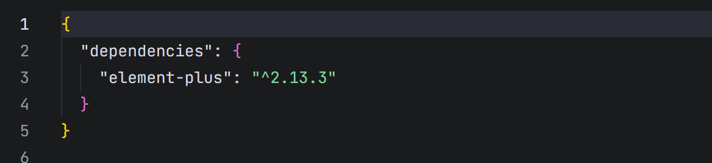
3. 检查 node_modules：你会发现多出了 async-validator 文件夹。
   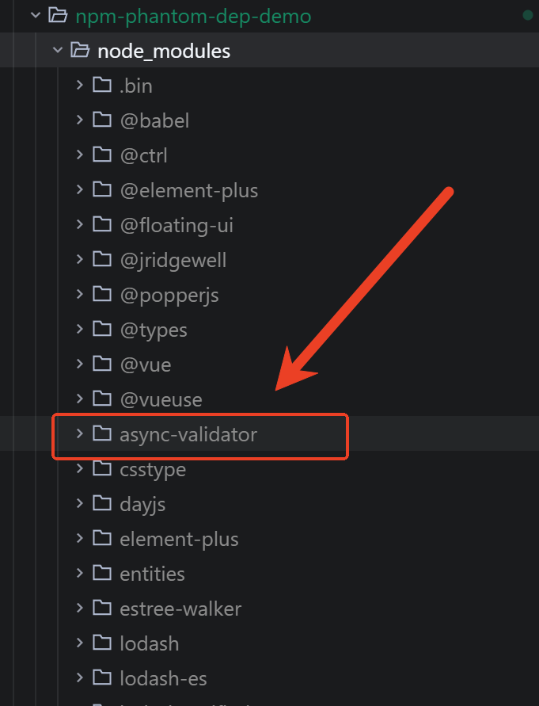
4. 你可以在代码里直接写 import Schema from 'async-validator'。因为 npm 的扁平化布局把这个“孙子辈”的依赖提到了根目录，导致你可以非法访问它。
   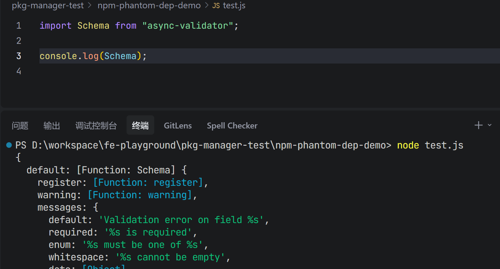
5. 如果有一天你升级了element-plus，同时 element-plus 的表单校验功能不再依赖 async-validator。这个时候你的代码在没有任何预警的情况下直接崩溃。

说完了npm带了的问题，下面谈一谈pnpm是如何解决的吧！！！

## pnpm 的破局之道：基于符号链接的严谨布局

如果你现在把 node_modules 删掉，改用 pnpm install element-plus：

1. pnpm 依然会下载 async-validator，但它会把它藏在 .pnpm 的虚拟存储池中。这种基于内容寻址的虚拟存储方式是通过**硬链接**的方式进行访问。
   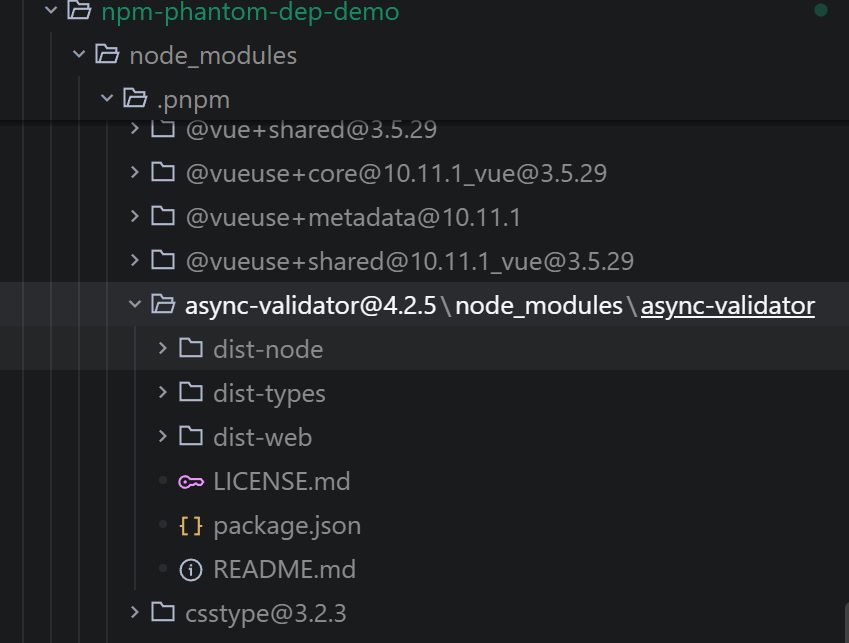

2. 同时在 node_modules 的根目录下，pnpm 只创建 element-plus 的**软链接**。
   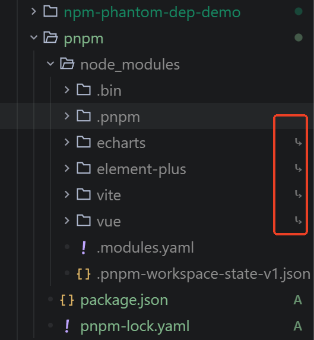

3. 当你运行 test.js 时，Node.js 找不到根目录下的 async-validator，会立刻报错提醒你。这强迫你必须显式地 pnpm add async-validator，从而保证了项目的稳定性。
   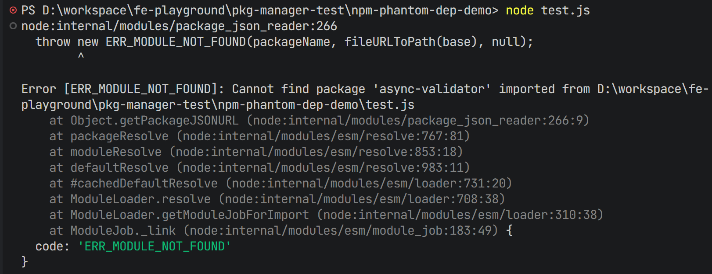

提示： 如果你还不明白什么是软硬链接的可以通过下面的 **如何理解软链接和硬链接？** 进行解惑。

## 首屏安装速度与磁盘占用 (Vite + Vue3 生态)

测试目标：在完全干净的环境下，对比安装 vite, vue, element-plus, echarts 及其依赖时的表现。

### 1. 准备测试环境

在执行每组测试前，请务必清理全局缓存和本地目录，以保证数据的准确性：

- ** 清理命令：**
- npm: npm cache clean --force
- yarn: yarn cache clean
- pnpm: pnpm store prune

删除本地目录：rm -rf node_modules package-lock.json yarn.lock pnpm-lock.yaml

#### 清除缓存的结果如下：

下图是清理缓存后的截图：
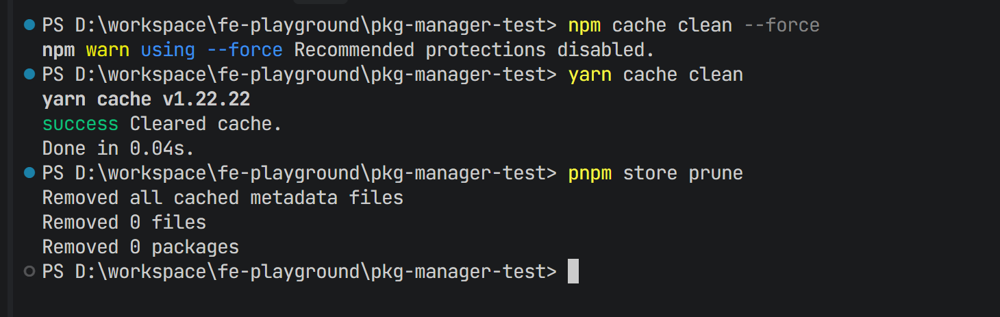

### 2. 测试操作步骤记录如下

如果你是 Windows 在 pkg-manager-test 目录下分别执行以下命令

1. 测试 npm 耗时

```PowerShell
Measure-Command { npm install vite vue element-plus echarts --no-audit } | Select-Object TotalSeconds
```

注： --no-audit 是为了排除安全扫描的额外干扰。

记录耗时如下：
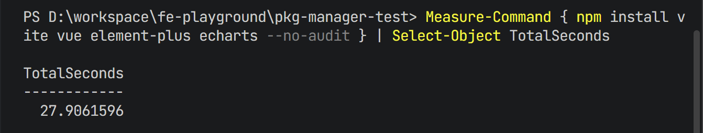

2. 测试 pnpm 耗时（对比重点）
   在运行前，请先删除上一步生成的 node_modules：

```PowerShell
rm -r -Force node_modules, package-lock.json
Measure-Command { pnpm add vite vue element-plus echarts } | Select-Object TotalSeconds
```

记录耗时如下：
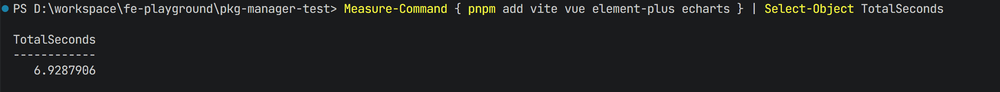

3. 测试 Yarn 耗时

同样先清理：

```PowerShell
rm -r -Force node_modules, pnpm-lock.yaml
Measure-Command { yarn add vite vue element-plus echarts } | Select-Object TotalSeconds
```

记录耗时如下：
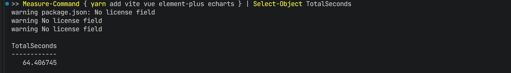

**使用 PowerShell 原生命令 计算文件夹大小并转换为 MB**

```PowerShell
(Get-ChildItem node_modules -Recurse | Measure-Object -Property Length -Sum).Sum / 1MB
```

### 文件结构对比

测试数据记录表：

指标 npm (v10.9.3) yarn (v1.22.22) pnpm (v10.30.3)
首次安装耗时 (Cold) 27.9s 64.4s 6.9s
二次安装耗时 (Hot) 15.8s 19.2s 5.9s
node_modules 体积 147.8MB 147.8MB 147.8MB
文件结构 扁平化 (Flat) 扁平化 (Flat) 基于内容寻址 (CAS/Symlink)
磁盘占用策略 每个项目复制一份 每个项目复制一份 全局硬链接 (Hard Link)

## npm、yarn、pnpm下载项目对比

使用 npm 时：

1. 项目 A： 下载 ==> 存入缓存 ==> 拷贝到项目 A。
2. 项目 B： 发现缓存已有 ==> 拷贝到项目 B。
3. 结果： 缓存占 1MB，项目 A 占 1MB，项目 B 占 1MB。总共占用 3MB。

结论：项目越多，磁盘浪费越严重。

使用 Yarn (v1.22 Classic) 时：

1. 项目 A：下载 ==> 存入 yarn-cache ==> 解压并拷贝到项目 A。
2. 项目 B：检测到离线缓存 ==> 解压并拷贝到项目 B。
3. 缓存 (1MB) + 项目 A (1MB) + 项目 B (1MB) = 总计占用 3MB。

结论： 磁盘空间优化上，它与 npm 殊途同归——都是物理拷贝。

使用 pnpm 时：

1. 项目 A： 下载 ==> 存入全局 Store ==> 在项目 A 创建一个 **快捷方式（硬链接）** 指向 Store。
2. 项目 B： 发现 Store 已有 ==> 在项目 B 创建一个快捷方式指向同一个 Store。
3. 结果： 全局 Store 占 1MB，项目 A 和 B 只是“影子”。总共占用 1.0001MB。

结论：项目 A 和 B 里的文件只是 Store 的“影子”。无论你开启多少个项目，磁盘上物理存在的永远只有那一份文件。

## 问题解答:

### 如何理解硬链接？

在理解什么是硬链接之前，需要理解什么是 `inode`？
解释：在文件系统中，inode 是文件的唯一身份标识，存储了文件的元信息（如权限、大小、数据块位置）。而文件名只是指向这个标识的一个“标签”。 inode像一个人的身份证号，而文件名像一个人的姓名，姓名可以更改或者有别称和小名，但是身份证无法更改，具有唯一性。
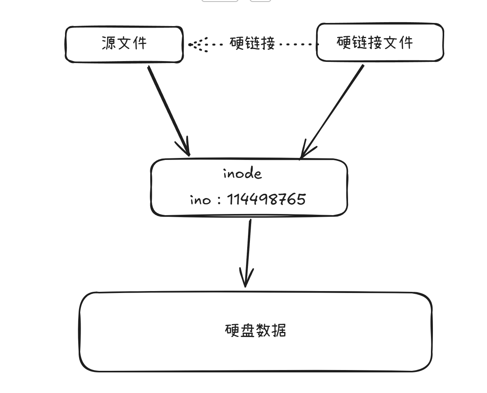

在理解了什么是 inode，就可以理解硬链接的本质。在 pnpm 的机制中，.pnpm 目录下的包是通过硬链接与全局 Store 关联的，这意味着它们拥有相同的 inode 号码，指向磁盘上同一块物理数据。换句话说你看到的.pnpm目录下的文件本质和当前磁盘下的`.pnpm-store`下的文件是相同的物理数据。所有即使你有100个项目都用到了相同的包，磁盘在上物理存储的代码只有一份。
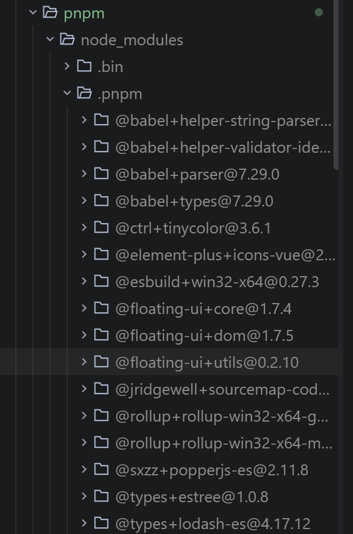

### 如何理解软链接？

软链接又叫符号链接，软链接的本质是一个链接文件，指向源文件的地址，类似索引或者指针。修改源文件内容，软链接的内容会随之改变，删除源文件会导致软链接的访问失效。下图是软链接和源文件的关系。
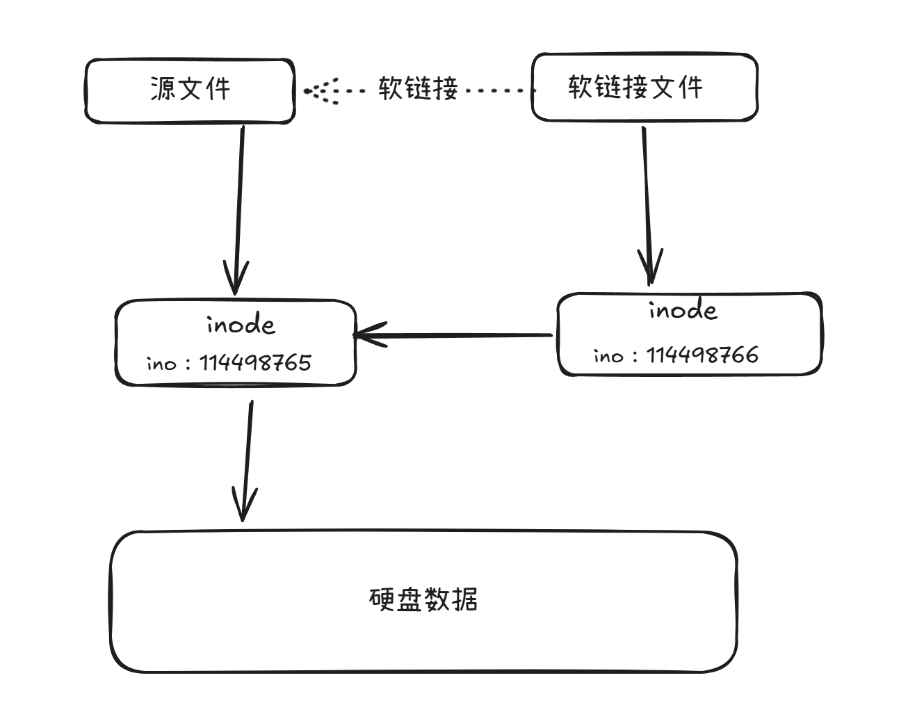

例如你看到的node_modules 根目录下的 vue 对应的软链接目标文件是：`node_modules/.pnpm/vue@3.5.29/node_modules/vue`
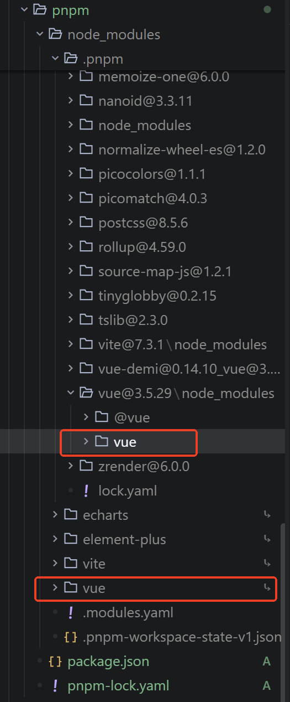

## 参考文章：

阮一峰：[理解inode](https://www.ruanyifeng.com/blog/2011/12/inode.html)
